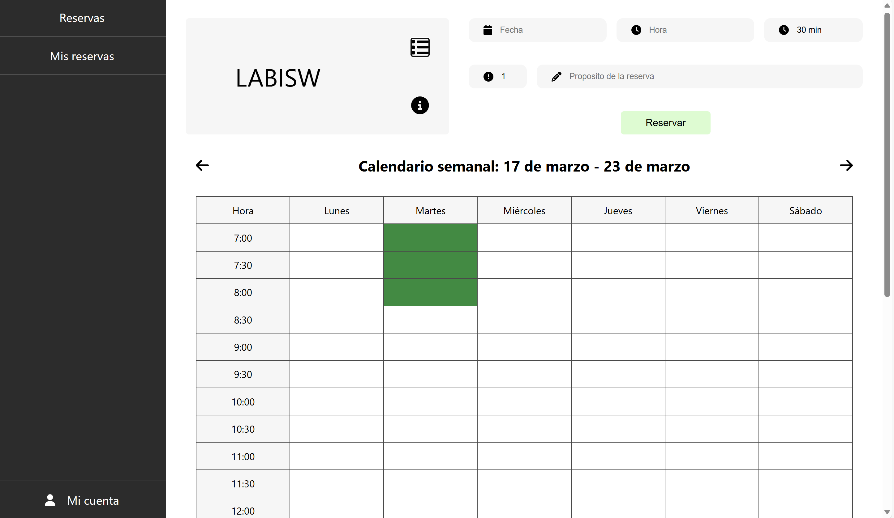
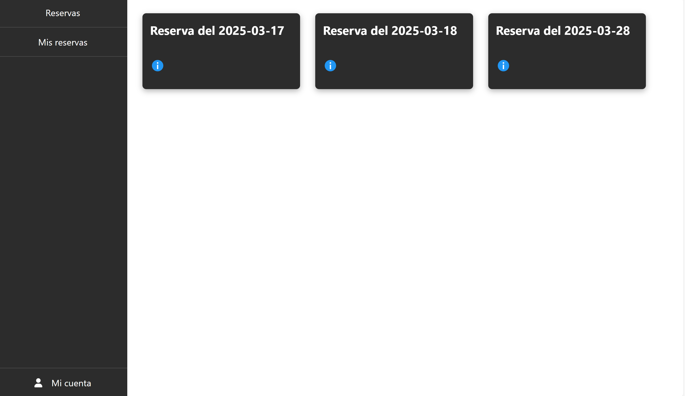
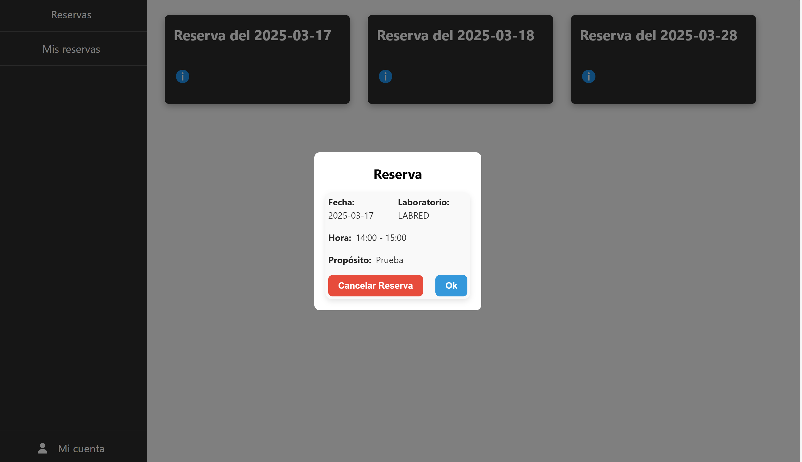
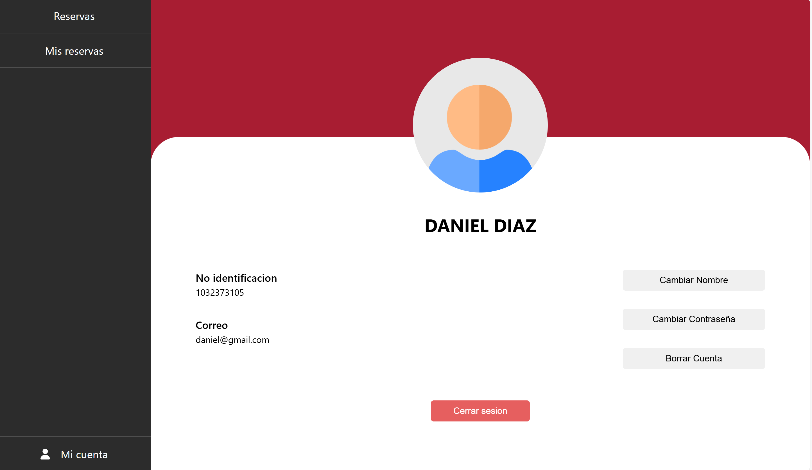

# 🎯 LABORATORIOS

**Escuela Colombiana de Ingeniería**  
📌 _Ciclos de Vida de Desarrollo de Software_

---

## 👥 Integrantes del grupo **FENRIR**

- 🏆 **Vicente Garzón Rios**
- 🏆 **Daniel Alejandro Diaz Camelo**
- 🏆 **Geronimo Martinez Nuñez**
- 🏆 **Carlos David Barrero Velasquez**

---

## 📌 Caso de Negocio: **Sistema de Reservas de Salones**

**Escuela Colombiana de Ingeniería Julio Garavito**

El proyecto consiste en una aplicación para la gestión de reservas de salones dentro de la **Escuela Colombiana de Ingeniería Julio Garavito**.

✔️ Los usuarios podrán **consultar la disponibilidad de salones**, realizar reservas y cancelar sus reservas desde una interfaz web.  
✔️ La aplicación se conectará a un **API REST** desarrollado en **Spring Boot**.  
✔️ Se utilizará **MongoDB Cloud** o **archivo de texto plano** para la persistencia de datos.

---

## ✅ Requerimientos

🔹 El usuario debe poder **consultar la disponibilidad de laboratorios**.  
🔹 El usuario debe poder **reservar un laboratorio** especificando **fecha, hora y propósito**.  
🔹 El usuario debe poder **cancelar sus reservas**.  
🔹 La aplicación debe **validar** que un laboratorio no se pueda reservar si ya está ocupado.

---

## 🏗️ Épicas

📌 **Backend:** Implementación de un **API REST** para la lógica de negocio y persistencia de datos.

---

## 🚀 Sprints

### 🏁 **Sprint 3**

---

### **Expectativa**

---

### **Realidad**

