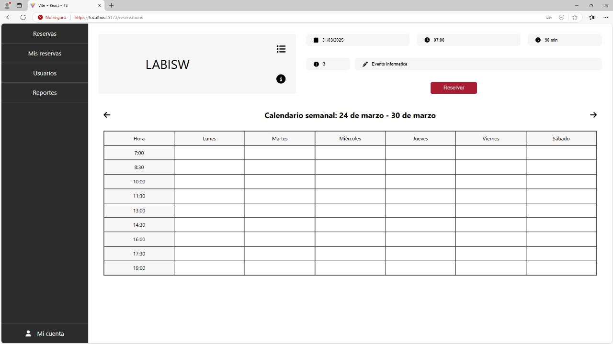

# 🎯 LABORATORIOS

**Escuela Colombiana de Ingeniería**  
📌 _Ciclos de Vida de Desarrollo de Software_

---

## 👥 Integrantes del grupo **FENRIR**

- 🏆 **Vicente Garzón Rios**
- 🏆 **Daniel Alejandro Diaz Camelo**
- 🏆 **Geronimo Martinez Nuñez**
- 🏆 **Carlos David Barrero Velasquez**

---

## 📌 Caso de Negocio: **Sistema de Reservas de Salones**

**Escuela Colombiana de Ingeniería Julio Garavito**

El proyecto consiste en una aplicación para la gestión de reservas de salones dentro de la **Escuela Colombiana de Ingeniería Julio Garavito**.

✔️ Los usuarios podrán **consultar la disponibilidad de salones**, realizar reservas y cancelar sus reservas desde una interfaz web.  
✔️ La aplicación se conectará a un **API REST** desarrollado en **Spring Boot**.  
✔️ Se utilizará **MongoDB Cloud** o **archivo de texto plano** para la persistencia de datos.

---

## ✅ Requerimientos

🔹 El usuario debe poder **consultar la disponibilidad de laboratorios**.  
🔹 El usuario debe poder **reservar un laboratorio** especificando **fecha, hora y propósito**.  
🔹 El usuario debe poder **cancelar sus reservas**.  
🔹 La aplicación debe **validar** que un laboratorio no se pueda reservar si ya está ocupado.

---

## 🏗️ Épicas

📌 **Backend:** Implementación de un **API REST** para la lógica de negocio y persistencia de datos.

---

## 🚀 Sprints

### 🏁 **Sprint 3**

---

### **Expectativa**

---

### **Realidad**

# Guía de Uso 

## 1. Inicio de Sesión  
Si ya tienes una cuenta, accede con tu correo electrónico y contraseña.  

## 2. Registro de Cuenta  
Si aún no tienes una cuenta, completa el formulario de registro. La contraseña debe cumplir los siguientes requisitos:  
- Mínimo **8 caracteres**  
- Al menos **una mayúscula**  
- Al menos **un número**  
- Al menos **un carácter especial**  

## 3. Reservaciones  
En este apartado podrás:  
- Seleccionar la **fecha** y la **hora de inicio**  
- Elegir la **duración** de la reserva (en minutos u horas)  
- Asignar un **nivel de prioridad** (del 1 al 5)  
- Elegir el **laboratorio** donde deseas realizar la reserva
- Ver la información **del laboratorio** seleccionado  

## 4. Mis Reservas  
Aquí encontrarás todas las reservas que has realizado.  
- Si no tienes reservas, aparecerá un mensaje notificándolo.  
- Si tienes reservas activas, podrás consultar sus detalles y cancelarlas si es necesario.  

## 5. Mi Cuenta  
En esta sección podrás:  
- Ver y editar tu **información personal**  
- Cerrar sesión de forma segura  

## Acceso como Administrador  

El proceso de **inicio de sesión** para un administrador es **idéntico** al de un usuario regular. Sin embargo, una vez dentro de la plataforma, el administrador tendrá acceso a **nuevas opciones** en la **barra lateral izquierda** .  

### Apartados Exclusivos para Administradores 

### Gestión de Usuarios  
Desde este apartado, el administrador puede:  
- **Crear nuevos usuarios**: Funciona como el proceso de registro habitual (*Sign Up*), pero lo realiza un administrador para otorgar cuentas directamente a los usuarios.  
- **Administrar usuarios**: Permite visualizar, modificar o eliminar cuentas existentes dentro del sistema.  

### Reportes y Análisis  
El administrador tiene acceso a una sección especial de **reportes**, donde podrá visualizar **gráficos analíticos** sobre:  
- **Los laboratorios más utilizados**.  
- **Tendencias en las reservas realizadas**.  
- **Horas pico de uso de los laboratorios**.

Estos informes permiten un mejor control y toma de decisiones sobre la gestión de los espacios dentro de la plataforma.

## 🎨 Tecnologías Utilizadas en el Frontend  

El frontend del proyecto fue desarrollado con las siguientes tecnologías:  

- **⚛️ React**: Framework principal para la creación de la interfaz de usuario.  
- **📡 Axios**: Librería utilizada para la comunicación con el backend a través de peticiones HTTP.  
- **🔐 SSL (Secure Sockets Layer)**: Implementado para asegurar la comunicación entre el frontend y el backend.  
- **🌐 HTML & CSS**: Para la estructura y el diseño visual de la aplicación.  
- **🖥️ Node.js**: Entorno de ejecución utilizado para la gestión del frontend y dependencias. 